## 12.17 Update

- 主页面

  contest文字去除

- Gallery（集锦）

  右边栏所有内容暂时隐藏

- Footer

  暂时只保留最左侧Xilinx Logo和最右侧的contact us

  - More about us -> 超链接到xilinx.com/university
  - contact us -> xup_xilinx@xilinx.com

## template: Fortune

Banner -> Banner

Latest Projects -> Featured Projects

Why Choose -> ~~Events~~ Programs

Testinomals -> Contest

~~Latest Projects -> Featured Projects~~

FAQs -> Resources & FAQs

Service（子页面） -> Gallery/ Projects Archive

## Footer Logo

(透明底、白色字)

## Header Logo

[原网站](https://openhw.org/index.html)为文字

## Banner

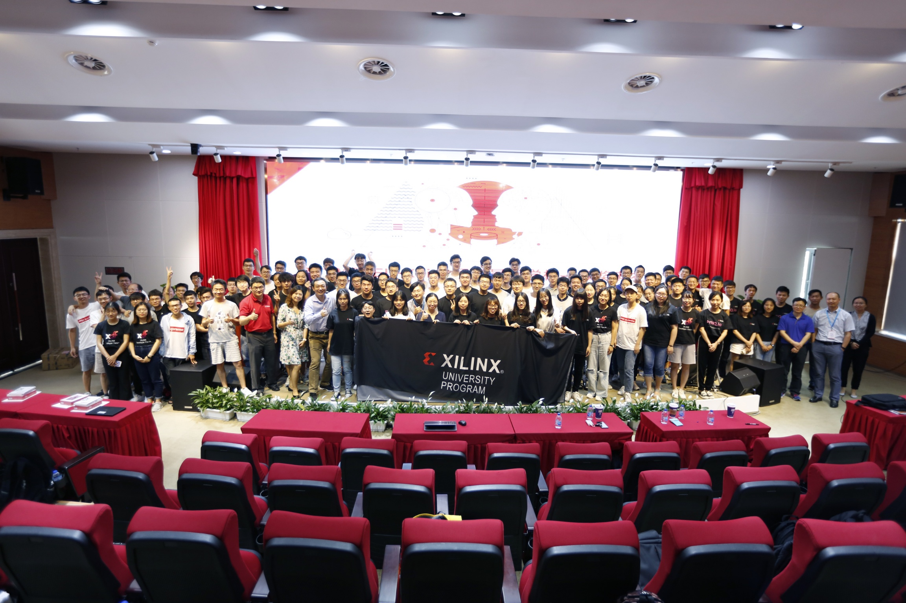

Summer camp

Winter Camp

Hackathon

## ~~Events~~ Program

Hackathon

暑期学校 https://xupsh.github.io/camp

冬令营 https://github.com/xupsh/2021_CN_WinterCamp

## Gallery布局（具体project在最后）

2021（暂无）

2020 （FPGA竞赛、冬令营（GitHub）、暑期学校（GitHub））

2019 FPGA竞赛、研电赛获奖

2018 见本目录下“往届获奖名单”

2017 FPGA竞赛、研电赛获奖

2016及以前：列表统计优秀项目名单（在本目录的“往届获奖名单”下）

具体项目可以在“往届获奖名单”中找到

## Resource & FAQs

FAQ/

OpenHW是怎样的平台

> OpenHW旨在搭建一个优秀开源FPGA硬件开发项目分享平台，每年度会进行优秀开源项目的评选。OpenHW也提供适用于各种程度开发人员的资源分享和培训。同时，OpenHW对接一系列国内赛事，涵盖应用开发、算法竞赛和硬件设计等方面

OpenHW和其他竞赛什么关系

> 目前OpenHW对接的比赛包括全国大学生创新大赛，研究生电子设计竞赛和定制计算算法实现挑战赛。比赛中的优秀作品将会进入OpenHW年度分享活动

我如何加入OpenHW平台

> 通过上述三项竞赛的优秀作品将会被邀请进入OpenHW的年度分享活动，同时，我们开通个人申请通道，若您有优秀作品想要分享，请联系[xup_china@xilinx.com](mailto:xup_china@xilinx.com)

OpenHW上作品的知识产权归属

> 在OpenHW平台上进行项目分享将不会影响您对于本作品的知识产权，但需要注意的是，我们将要求使用MIT License作为所有项目的开源许可

除了比赛项目还有哪些服务

> 我们提供面向入门阶段工程师培训的暑期学校，面向科研和计算加速的冬令营；同时，我们提供基于项目学习（Project Based Learning，PBL）的Hackathon培训，向更多感兴趣的工程师、学生等提供基础培训和体验活动

Resources: 

[Xilinx GitHub](http://www.github.com/xilinx)

[xupsh GitHub](http://www.github.com/xupsh) 

[Xilinx Wiki](http://forums.xilinx.com/)

[Developer Forum](http://forums.xilinx.com/)

PYNQ开源社区公众号

[PYNQ.io](http://pynq.io/)

[PYNQ GitHub](http://www.github.com/xilinx/pynq)

[PYNQ documentation](http://pynq.readthedocs.io/)

[PYNQ support forum](https://discuss.pynq.io/)

Linux Related

[Xilinx Linux Wiki](http://www.wiki.xilinx.com/)

[Xilinx Linux Technical Articles](http://www.wiki.xilinx.com/Technical+Articles)

[Zybo Linux Tutorial](http://www.instructables.com/id/Embedded-Linux-Tutorial-Zybo/?ALLSTEPS)

Xilinx University Program Website : [www.xilinx.com/university](http://www.xilinx.com/university)

## Contests

目前的contests包括

全国大学生FPGA创新设计竞赛 https://fpgachina.cn

研究生电子设计竞赛 [中国研究生创新实践系列大赛管理平台 (acge.org.cn)](https://cpipc.acge.org.cn/cw/hp/6)

[定制计算算法实现挑战赛| CCC2021 (xupsh.github.io)](https://xupsh.github.io/ccc2021/)

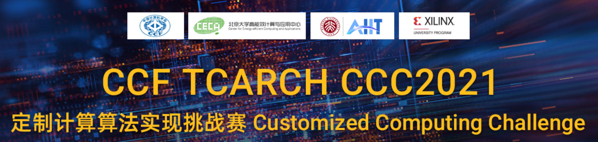

## 每年Featured Projects
### 2021

#### From FPGA Innovation Contests(Link暂无)

基于Artix-7的导线、网络长度测量仪
利用两路相位相同、频率固定的正弦波之间的相位差和周期数，精准测量外部导线或网络长度

基于FPGA的一种抗量子数字签名加密

基于Rainbow抗量子算法开发了一套抗量子通信系统，该算法能够抵御目前已知网络信息伪造手段，其复杂度已经超过了量子计算机理论可暴力破解的范围

基于FPGA的音游作曲一体机

让广大音乐爱好者能随时随地创造音乐，让音乐小白能快速体验玩音乐的魅力。

基于时滞储备池的混沌加密通信系统设计

 基于ZYNQ7020设计的混沌加密通信系统，应用储备池计算(Reservoir Computing)中的时滞储备池模型(Time-delay Reservoir)实现对视频的加密传输。

小规模SLAM视觉里程计加速专用电路

利用专用设计电路，在加速SLAM视觉里程中实现了性能和面积的双赢

基于RISC-V的积木式可拼接图像化编程系统

一种灵活的，可拖拽的积木式编程系统，编程对象是移植于FPGA上的RISC-V软核

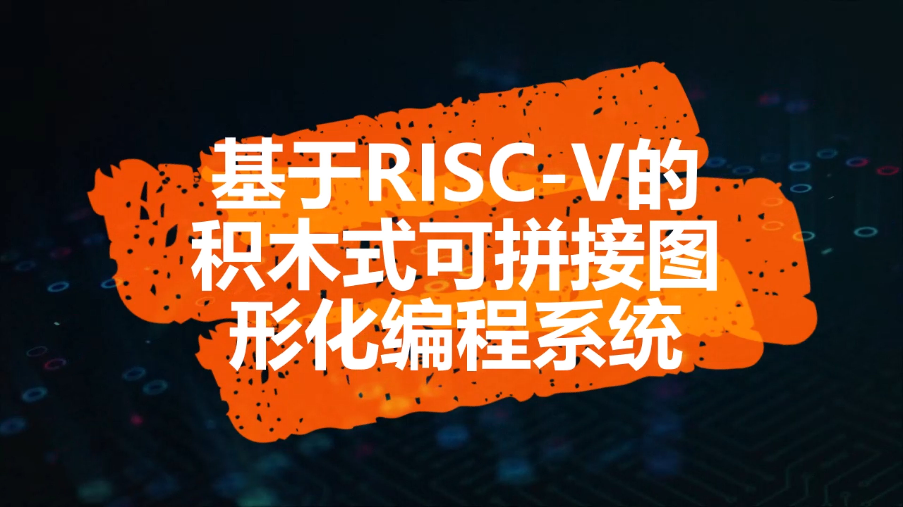

基于ZYNQ7035的相干激光测风雷达系统

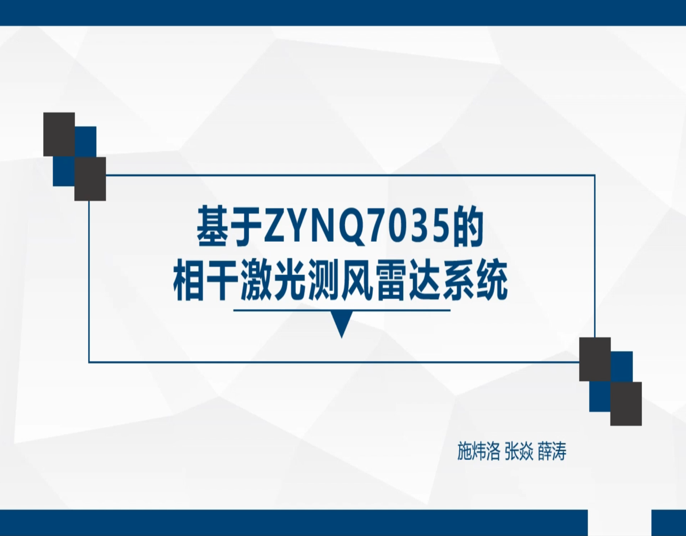

基于序列神经网络的自适应光纤传感系统

将序列神经网络部署到FPGA平台，对传感信号进行处理，以恢复信道冲激响应，从而自适应调整传感系统状态。

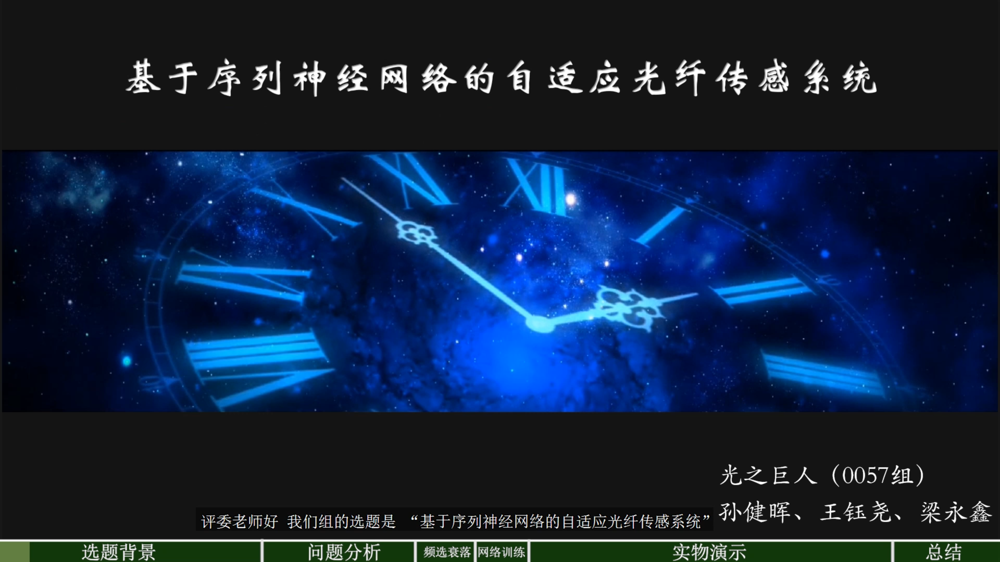

基于PYNQ-DPU的RSNA肺炎检测

使用了Xilinx近年开发的DPU硬件平台，开发者只需要关注网络的训练和环境的搭建即可在多种网络间灵活切换。

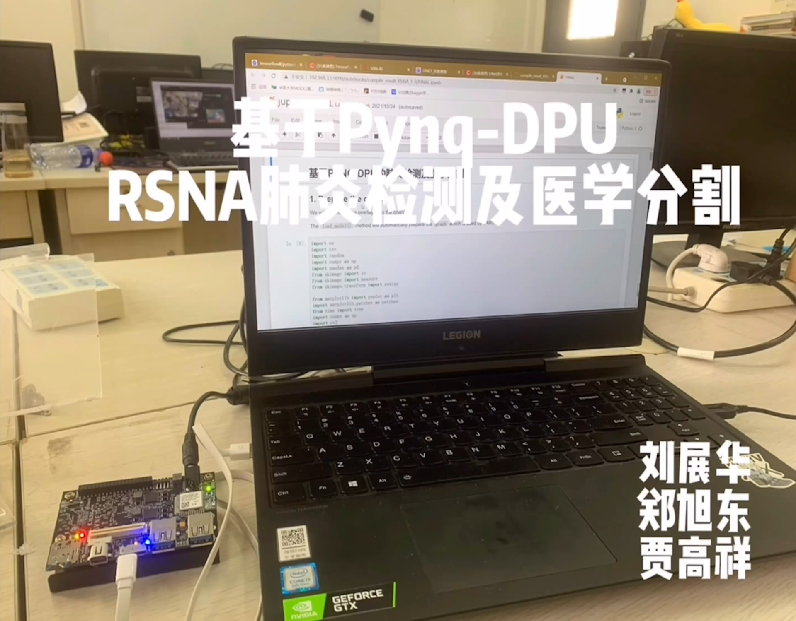

基于PYNQ的核酸采样装置

在进行咽拭子核酸样本的采集过程中，医护人员采样过程中具有交叉感染风险。因此，可采用自动化的机器人设备来代替操作流程

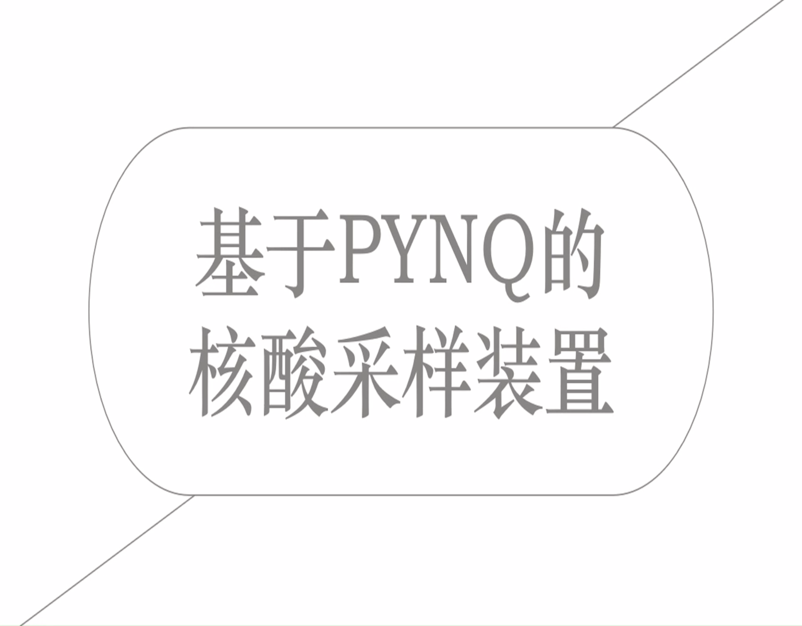

基于单目深度估计网络的全息显示终端

单目深度估计，常用于增强现实和医学成像，有望取代现有的深度传感器，使用HLS搭建FastDepth网络

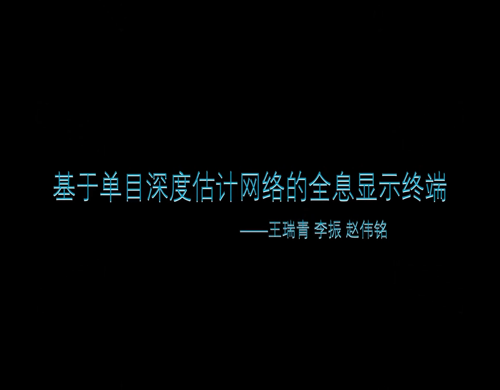

基于神经网络的心肺音分离系统

一款集采集，分离，音频和波形输出为一体的心肺音分离听诊系统。通过LSTM的特性对音频信号进行特征提取，实现即时的心肺音分离

基于小型旋转永磁体式机械天线的跨介通信系统

跨水-空介质直接通信在国防军事领域应用广泛，基于小型机械天线的低频电磁波收发技术是实现泛在跨介质通信的颠覆性方案

### 2020

#### From OpenHW2020 Seminar

活动链接[GitHub - xupsh/OpenHW_2020: OpenHW_2020 seminar](https://github.com/xupsh/OpenHW_2020)

项目：

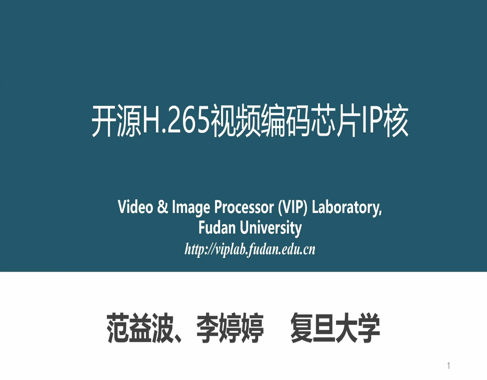

link: 开源H.265视频编码芯片IP核 http://openasic.org/

link: Design Space Exploration of Enegy Efficient Lightweight Neural Network on Edge FPGA https://github.com/jiangwx/SkrSkr

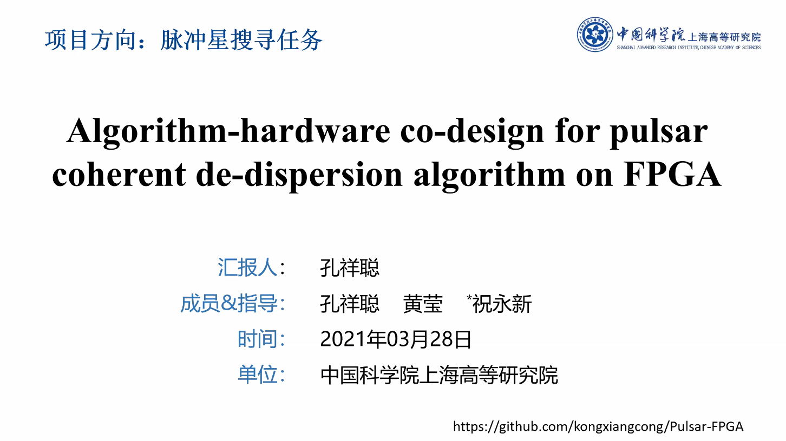

link: Algorithm-hardware co-design for pulsar coherent de-dispersion algorithm on FPGAhttps://github.com/kongxiangcong/Pulsar-FPGA

link: [基于HLS的LZ77数据压缩算法实现](https://github.com/bjrjk/HLS-LZ77)

(本项目没有封面)

link: [基于PYNQ的类脑计算平台](https://github.com/clancylea/SNN-simulator-NEST_14.0-xilinx_FPGA_cluster)

(本项目没有封面)

link: [逆运动学算法的硬件加速](https://github.com/CICS-ICT/ik-acceleration)，论文 ["Dadu: Accelerating Inverse Kinematics for high-DOF robots"](http://ieeexplore.ieee.org/document/8060343/)

link : [基于FPGA异构平台神经网络加速器的设计与实现](https://github.com/dhm2013724/yolov2_xilinx_fpga)

#### 2020 Summer Camp

[GitHub - xupsh/2020_SummerCamp](https://github.com/xupsh/2020_SummerCamp)

link: [基于PYNQ的深度卷积网络加速设计](https://github.com/Memory-bread/SSD_IN_PYNQ)

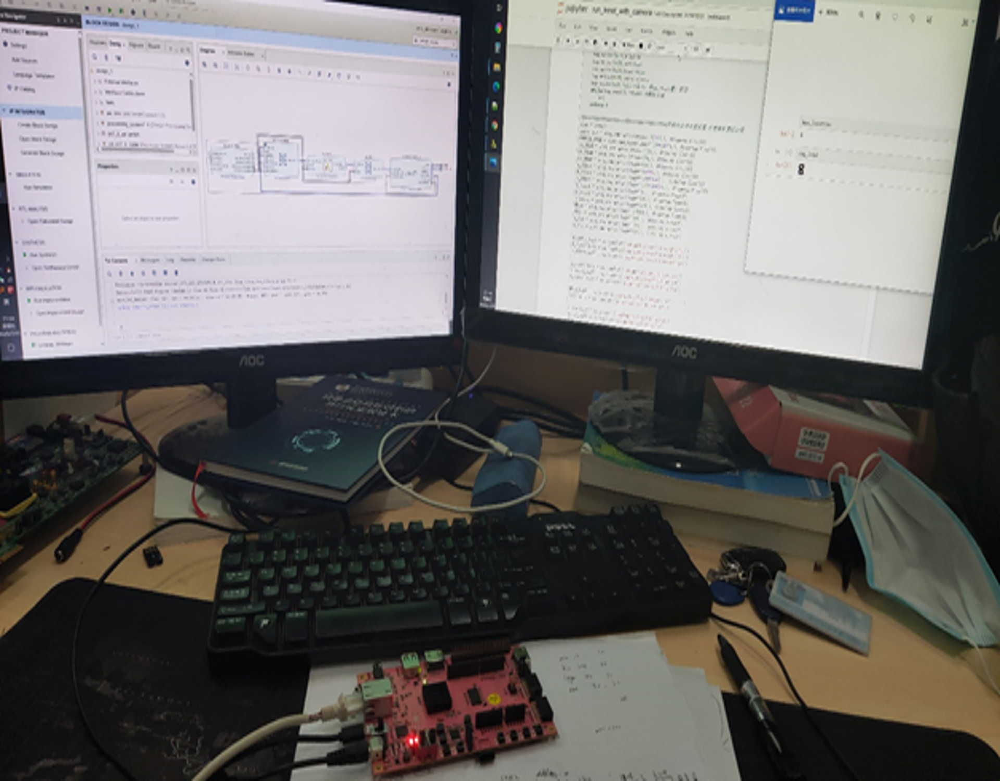

[基于FPGA加速的手写数字识别网络部署](https://github.com/Psyduckcoco/lenet-5)

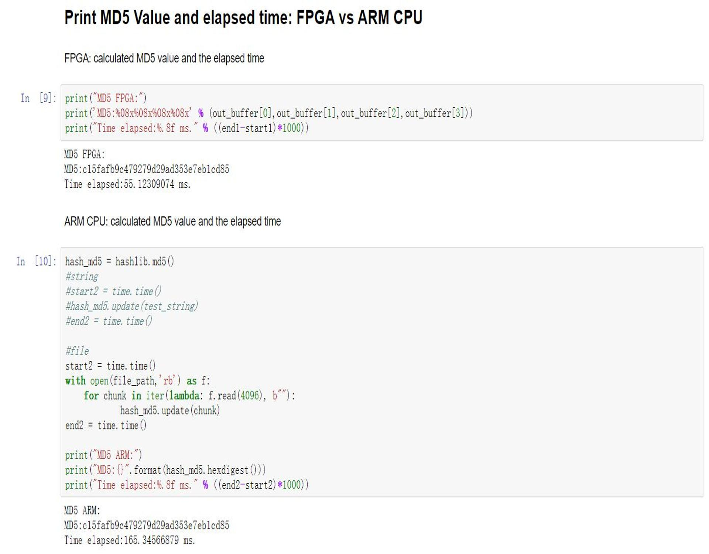

[MD5算法的FPGA实现](https://github.com/Gatsby253/HLS-MD5.git)

### 2019

[FPGA竞赛首页_FPGA竞赛_全国大学生fpga创新设计竞赛官网 (fpgachina.cn)](http://www.fpgachina.cn/video/reviewList?reviewType=1&value=6&pageNumber=1) 第三届一等奖、特等奖

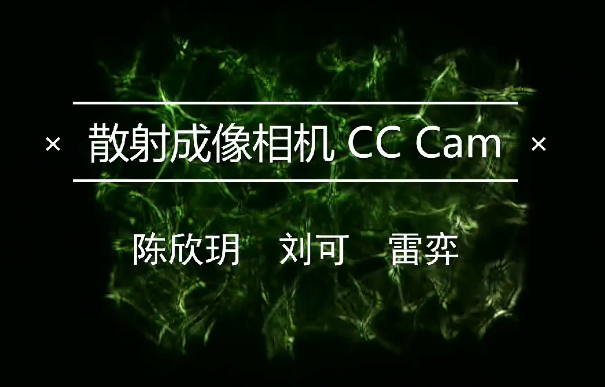

[基于PYNQ的散射成像相机 CC Cam](http://www.fpgachina.cn/videoDetails?value=6&id=7d263571ad9e4839b8346276d12f5e84&reviewMark=6)

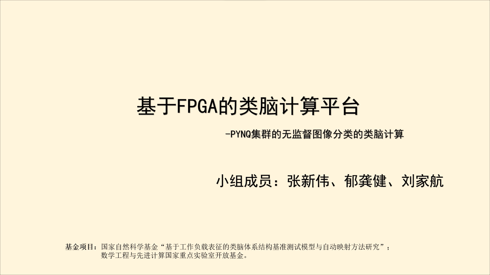

[基于FPGA的类脑计算平台](http://www.fpgachina.cn/videoDetails?value=6&id=c13fe28c4de94be688d11c35216bfd0d&reviewMark=6)

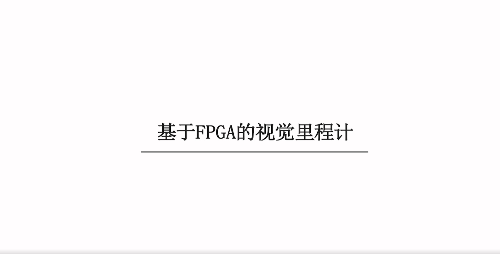

[基于FPGA的视觉里程计](http://www.fpgachina.cn/videoDetails?value=6&id=0f7d055e12db424c8ed88ec5af47c093&reviewMark=6)

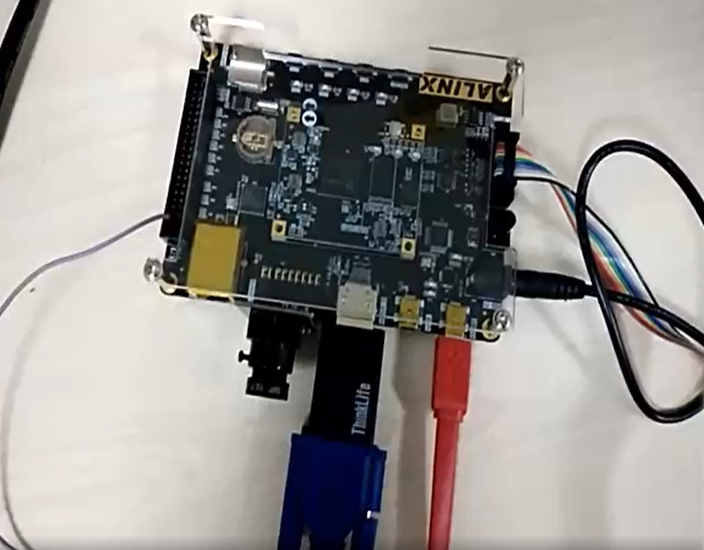

[任意角度图像旋转控制器](http://www.fpgachina.cn/videoDetails?value=6&id=6424d6353c384c4f8dfb4f37effaa5e1&reviewMark=6)

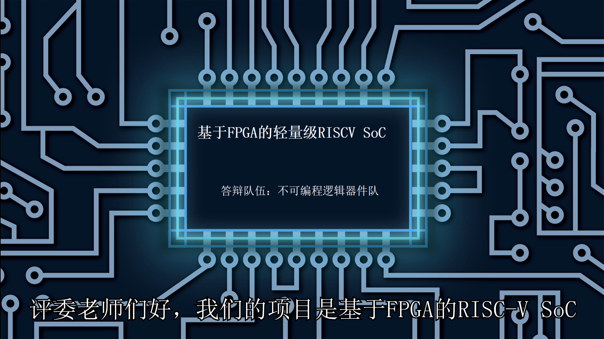

[基于FPGA的轻量级自研RV32IA软核（计算机系统）](http://www.fpgachina.cn/videoDetails?value=6&id=bb2d9e7789f646ff9e9c65715d46f064&reviewMark=6)

[基于FPGA的便携式DDS信号源与示波器的混合设计与开发](http://www.fpgachina.cn/videoDetails?value=6&id=031605a15dac4843aee0ac88dab9ad74&reviewMark=6)

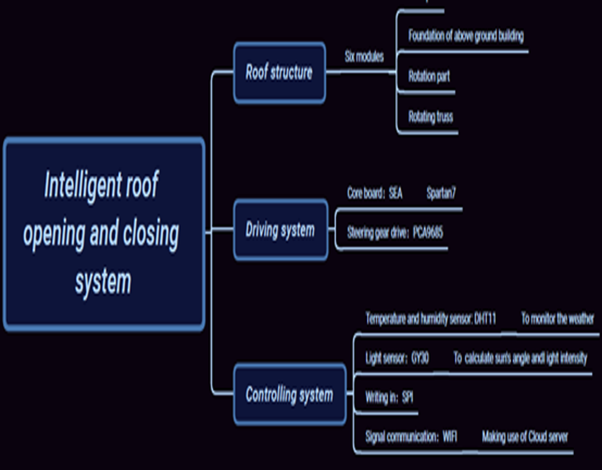

智能屋盖开合系统（见 .\往届获奖名单\2019 China National College FPGA Design Contest Final.pptx）

（视频损坏）

[基于Xlinx Artix7的声源定位装置](http://www.fpgachina.cn/videoDetails?value=6&id=404f263aa07749ffacb35db537a8006b&reviewMark=6)

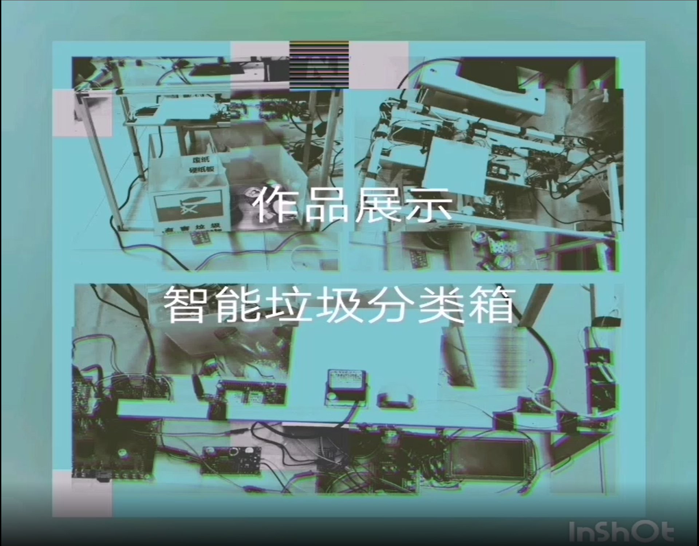

[基于pynq的智能分类垃圾系统](http://www.fpgachina.cn/videoDetails?value=6&id=a003929131b84fe4bd91933894aa841b&reviewMark=6)

[基于Facenet与物联网的智能门锁](http://www.fpgachina.cn/videoDetails?value=6&id=2888a3531863482697b59b843a7d0368&reviewMark=6)

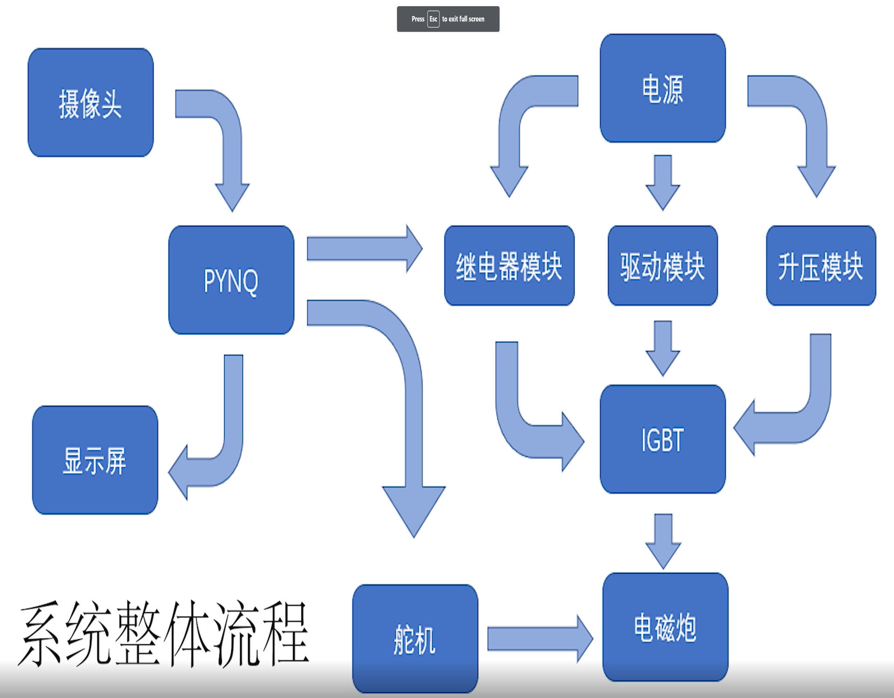

[基于FPGA的目标跟踪电磁炮系统](http://www.fpgachina.cn/videoDetails?value=6&id=3230d93051cc4055921a1f85a619a558&reviewMark=6)

## 2018

见 .\往届获奖名单\2018 Xilinx OpenHW Contest\2018 Xilinx OpenHW Contest

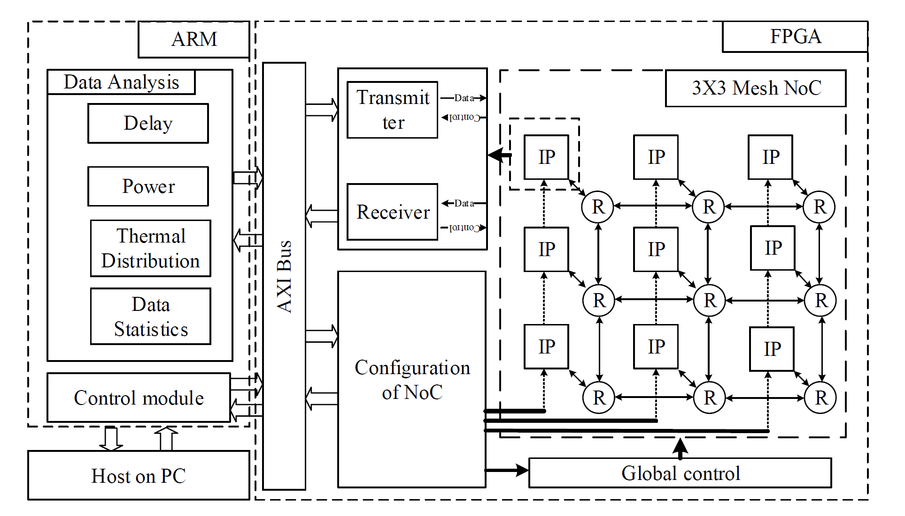

".\往届获奖名单\2018 Xilinx OpenHW Contest\No.2 An Ultra-fast NoC Simulator based on Zynq.pdf"

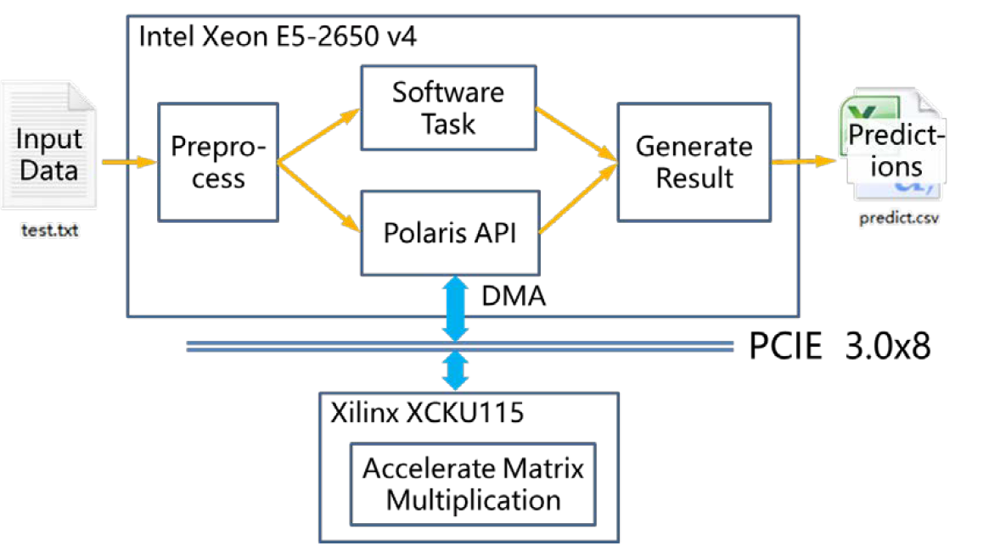

".\往届获奖名单\2018 Xilinx OpenHW Contest\No.15_A Deep FM Acceleration Algorithm based on Baidu Cloudí»s Heterogeneous Multicore Platform.pdf"

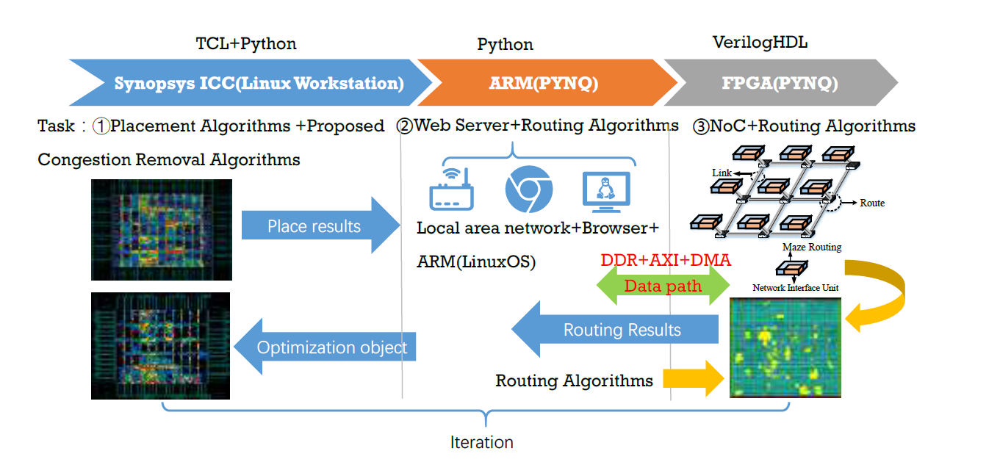

".\往届获奖名单\2018 Xilinx OpenHW Contest\No.11_Chip Physical Design EDA Tool on PYNQ.pdf"

".\往届获奖名单\2018 Xilinx OpenHW Contest\No.13_Object tracking system.pdf"

"D:\Distribute for guo\往届获奖名单\2018 Xilinx OpenHW Contest\No.7_Moving target detection system based on ZYNQ.pdf"

[FPGA竞赛首页_FPGA竞赛_全国大学生fpga创新设计竞赛官网 (fpgachina.cn)](http://www.fpgachina.cn/video/reviewList?reviewType=1&value=6&pageNumber=3) 第二届一等奖、特等奖

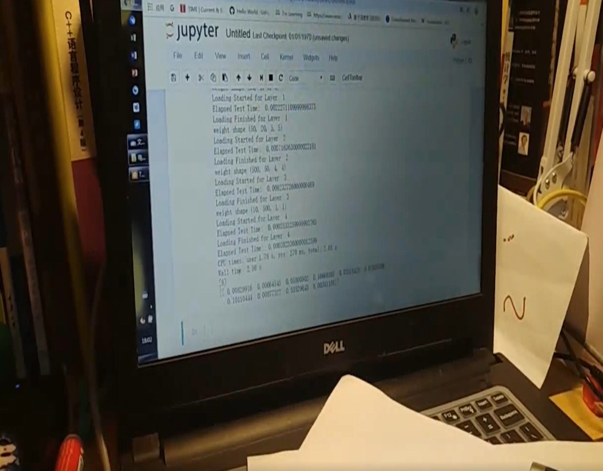

[基于神经网络的语音识别系统设计](http://www.fpgachina.cn/videoDetails?value=6&id=f109493cb00444b58fe3b4280d357a78&reviewMark=6)

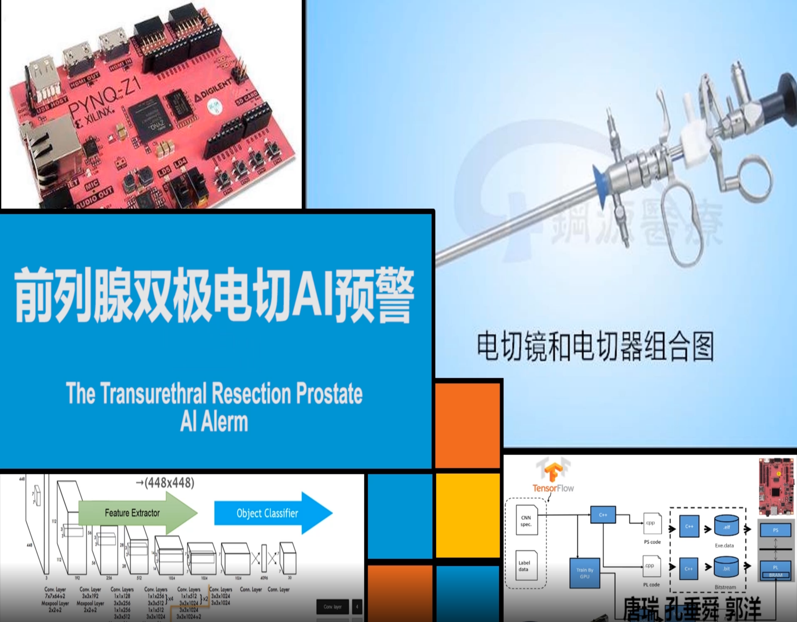

[前列腺增生双极电切AI预警](http://www.fpgachina.cn/videoDetails?value=6&id=f330926819d24adc8f96b3cb9c168bbd&reviewMark=6)

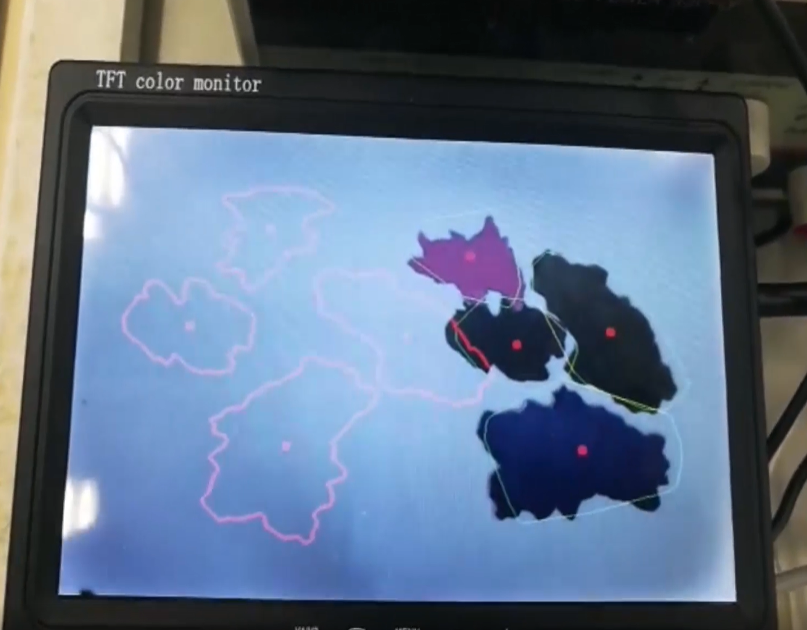

[基于 PYNQ-Z2 的地图轮廓识别拼接装置](http://www.fpgachina.cn/videoDetails?value=6&id=09f32e7de36f4044a468095ecc49a558&reviewMark=6)

[基于Zynq的夜间图像增强与边缘检测平台](http://www.fpgachina.cn/videoDetails?value=6&id=e13c761c124b4973b377231e30b8dbc1&reviewMark=6)

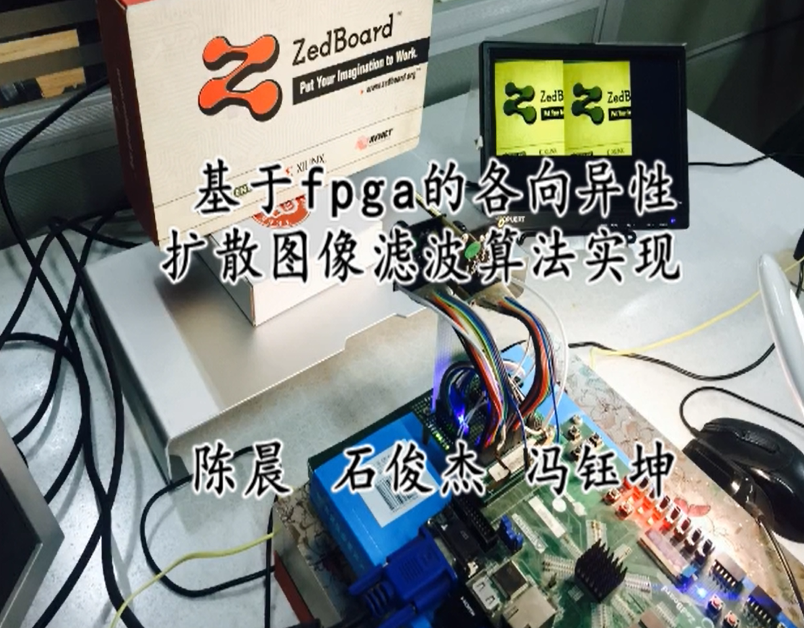

[基于fpga的各向异性扩散图像滤波算法实现](http://www.fpgachina.cn/videoDetails?value=6&id=f2921cbf9766412c82036401cf504ed8&reviewMark=6)

### 2017 

### 2016 and Earlier

#### 2016

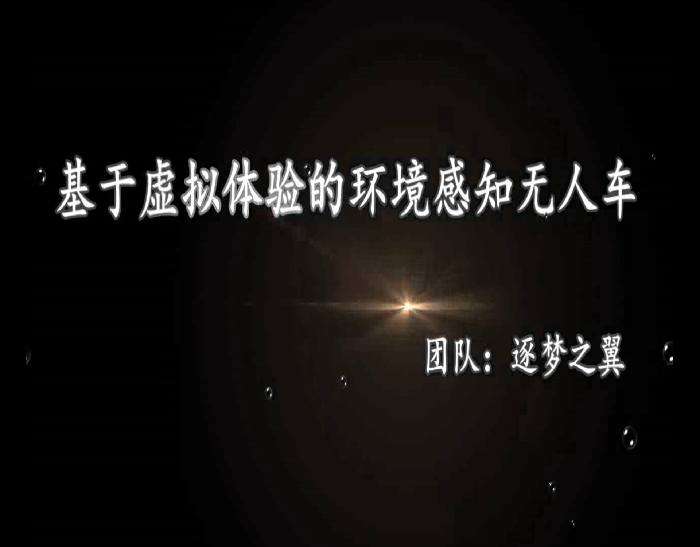

".\往届获奖名单\2016学生作品视频\（视频）基于虚拟体验的环境感知无人车.mp4"

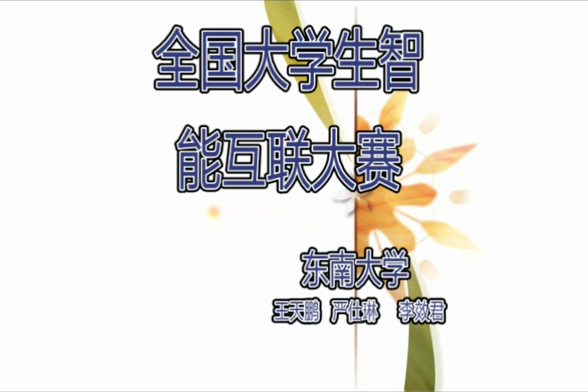

".\往届获奖名单\2016学生作品视频\华东赛区_东南大学_王天鹏_基于fpga的多功能多足爬墙机器人.mp4"

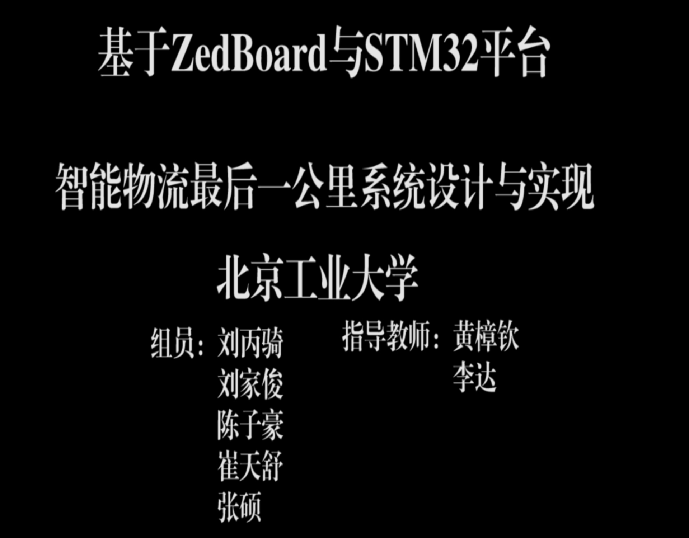

".\往届获奖名单\2016学生作品视频\华北赛区-北京工业大学-刘丙骑-基于ZedBoard与STM32平台的智能物流最后一公里系统设计与实现.mp4"

".\往届获奖名单\2016学生作品视频\华北赛区-清华大学-杨志坚-基于ZedBoard的民航飞机监测系统.mkv"

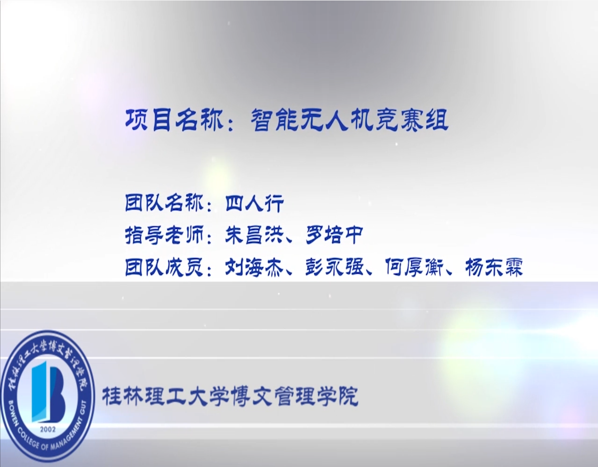

".\往届获奖名单\2016学生作品视频\华南赛区-桂林理工大学博文管理学院-刘海杰-智能无人机竞速四人行组飞行演示视屏.mp4"

".\往届获奖名单\2016学生作品视频\智能互联大赛-室内复杂环境自主导航巡检机器人.avi"

#### 2015

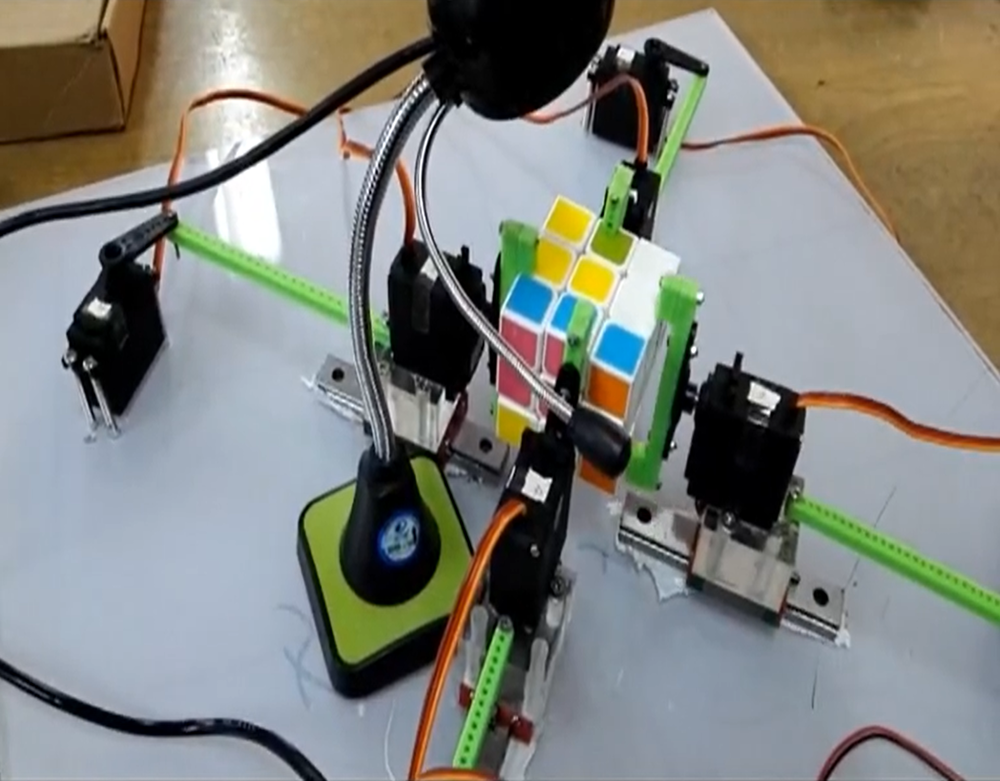

[基于FPGA的极速还原三阶魔方-中国矿业大学_2015江苏省FPGA竞赛](https://v.youku.com/v_show/id_XNDMxODI5NDgwNA==.html?spm=a2hcb.profile.app.5~5!2~5~5!3~5!2~5~5!48~A!2)

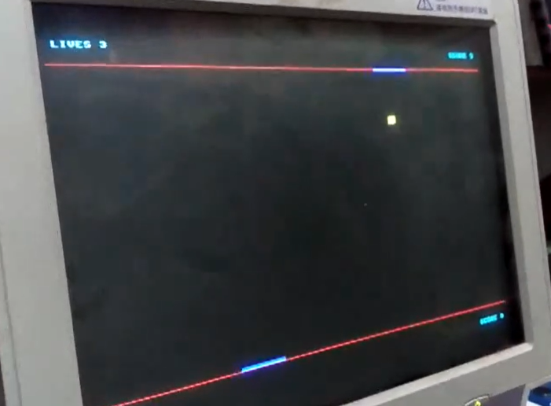

[基于BASYS3的乒乓球游戏-合肥工业大学_2015江苏省FPGA竞赛](https://v.youku.com/v_show/id_XNDMxODM0MzgyOA==.html?spm=a2hcb.profile.app.5~5!2~5~5!3~5!2~5~5!43~A!2)

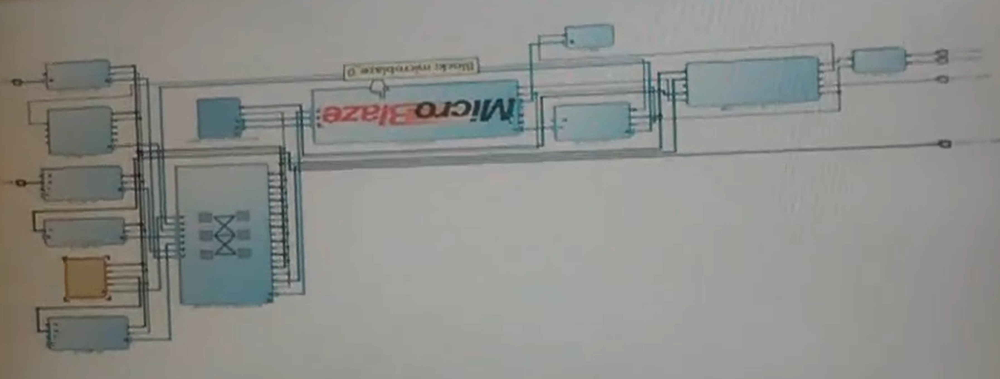

[基于软核频率计设计-淮阴师范学院_2015江苏省FPGA竞赛](https://v.youku.com/v_show/id_XNDMxODMwODY2OA==.html?spm=a2hcb.profile.app.5~5!2~5~5!3~5!2~5~5!46~A!2)

[智能家居机器人-华中科技大学_2015江苏省FPGA竞赛](https://v.youku.com/v_show/id_XNDMxODMyMDQ4OA==.html?spm=a2hcb.profile.app.5~5!2~5~5!3~5!2~5~5!51~A!2)

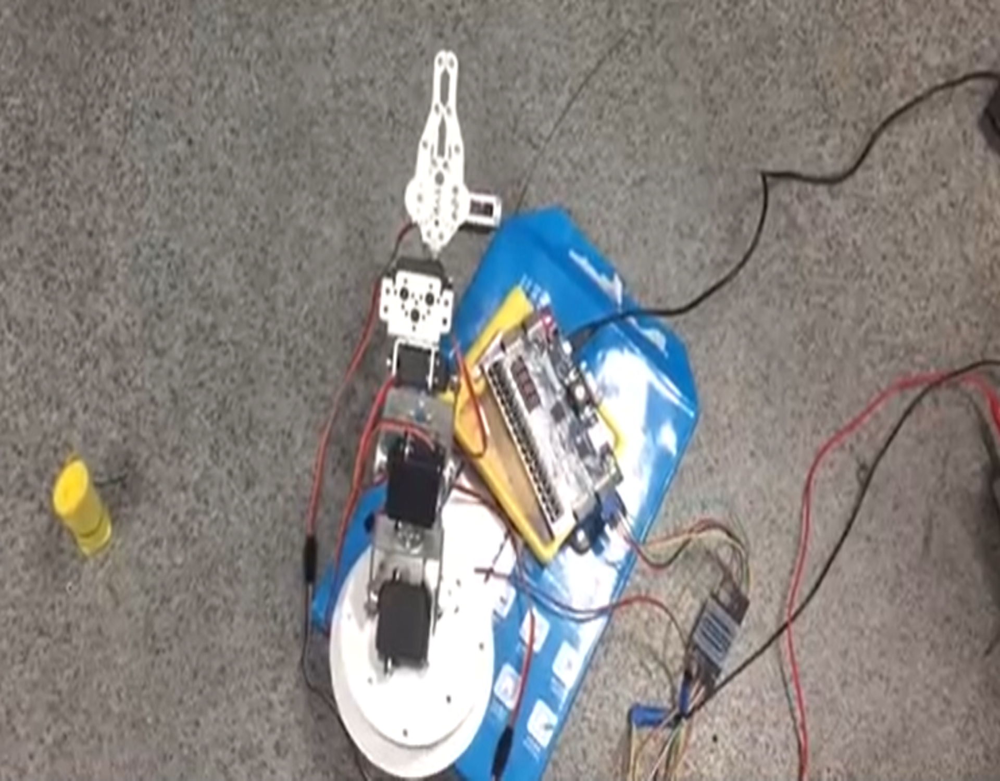

[基于FPGA的四自由度机械手控制系统-电子科技大学](https://v.youku.com/v_show/id_XNDMxODMxODU2NA==.html?spm=a2hcb.profile.app.5~5!2~5~5!3~5!2~5~5!53~A!2)

2015 Others -> [Xilinx University Program (youku)](https://www.youku.com/profile/index?spm=a2hcb.playlsit.table.d_myzipindao&theme=undefined)

#### 2012~2013

见.\往届获奖名单\openHW2012获奖.xlsx"

#### 2010~2011

见".\往届获奖名单\openHW2011获奖.xlsx"

#### 2009 ~ 2010

见".\往届获奖名单\openHW2009获奖.xlsx"

#### 2007 ~ 2008

见".\往届获奖名单\openHW2008获奖.xlsx"

